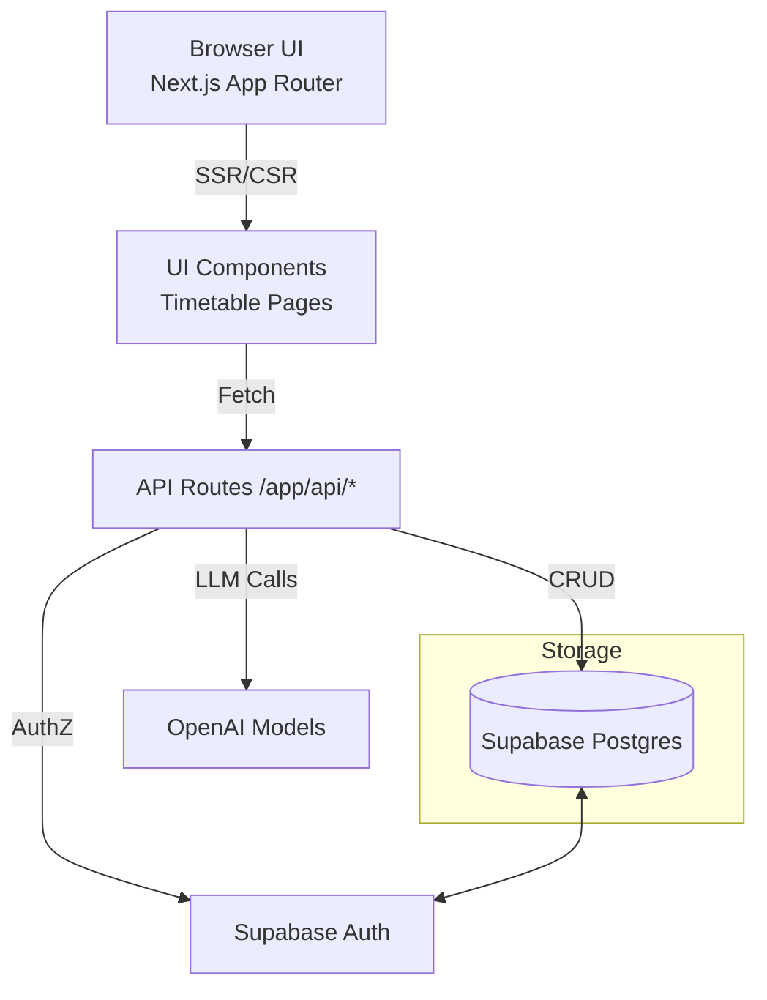
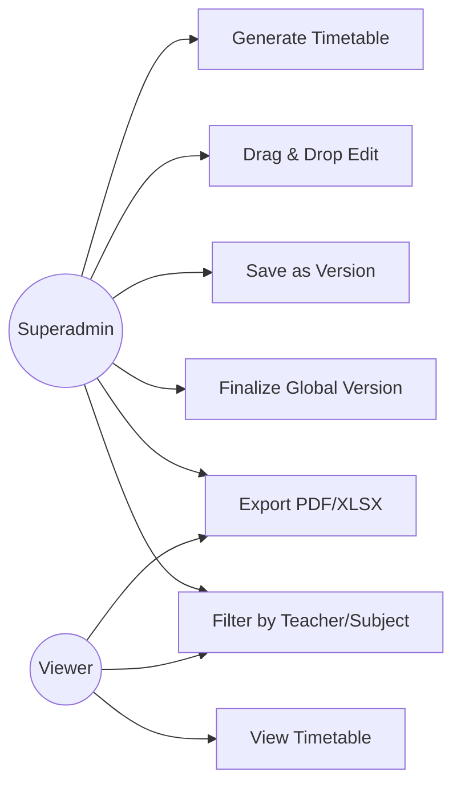
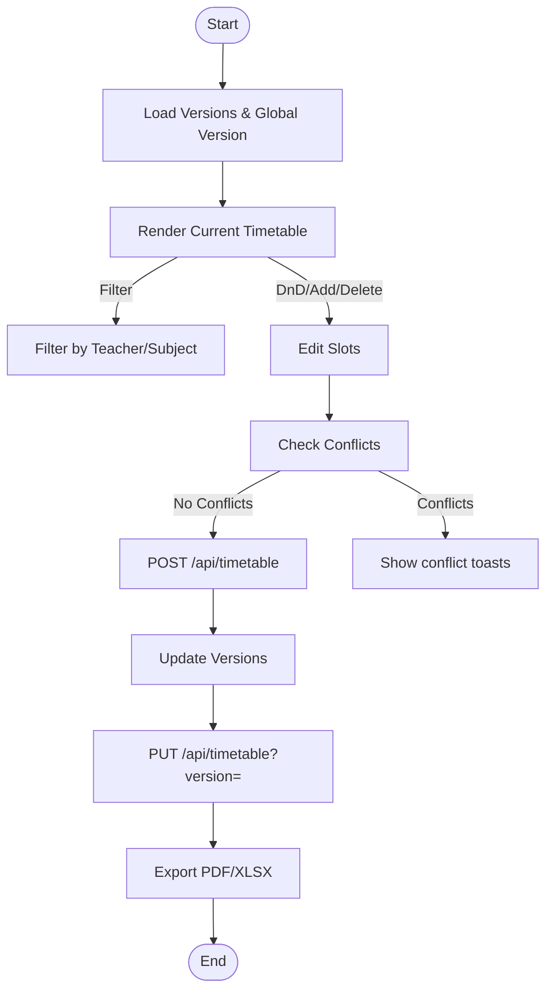
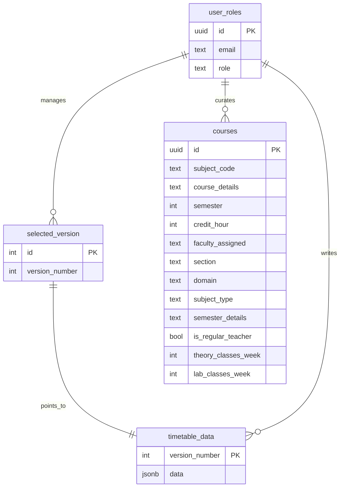
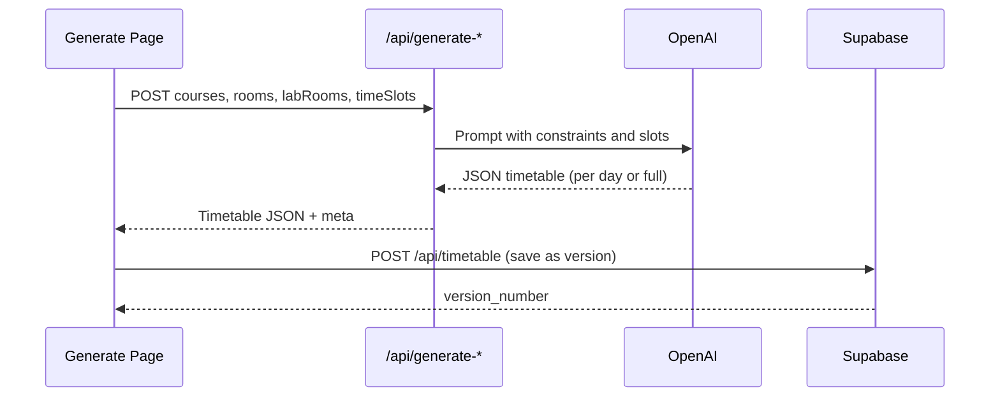

### TIMETABLE MANAGEMENT SYSTEM (CS Dept – KIU)

Department of Computer Science, Faculty of Natural Science and Engineering, Karakoram International University (KIU), Gilgit

September, 2025

---

### CERTIFICATE OF APPROVAL
This project report titled “Timetable Management System” is hereby approved in partial fulfillment of the requirements for the degree of Bachelor of Science in Computer Science at Karakoram International University (KIU), Gilgit.

Thesis Supervisor: ______________________

Chairperson/HOD: ________________________

External Examiner: ______________________

---

### DEDICATION
Dedicated to our families, mentors, and peers for their unwavering support.

---

### DECLARATION
We declare that this report is our own work and has not been submitted elsewhere for any award.

---

### ACKNOWLEDGEMENTS
We thank our supervisor and the department for guidance and infrastructure support. We also acknowledge the open-source community behind Next.js, Supabase, and related libraries.

---

### ABSTRACT
Timetable Management System (TMS) is a web app for the Department of Computer Science at Karakoram International University (KIU), Gilgit. It helps staff make the weekly class timetable fast and without common mistakes. The app can create a first draft from course data, lets you fix it with simple drag‑and‑drop, checks for clashes right away, saves each change as a new version, lets you pick a final version, and exports clean PDF and Excel files for sharing. The frontend is built with Next.js, and Supabase is used for the database and sign‑in. For automatic drafts, the app can ask an AI model to fill the timetable either day by day or in larger batches. Basic rules are always enforced: a teacher or a section cannot be in two places at the same time, lab classes go to lab rooms, and theory classes avoid lab‑only rooms. When a conflict appears during editing, the app shows a clear message and blocks strict saves until the issue is fixed. Each save becomes a version so you can see history and roll back if needed. In practice, this reduced manual work and cut errors. The app does not yet include full optimizers for room capacity or teacher availability, but it is easy to add them later. In short, TMS gives the CS department a simple, reliable way to build, review, and publish the timetable.

---

### TABLE OF CONTENTS
- Introduction
  - Background
  - Project Overview
  - Motivation
  - Problem Statement
  - Aims and Objectives
  - Advantages of the Proposed System
- Review of Literature
- Requirement Specification
  - Functional Requirements
  - Non‑functional Requirements
  - Required Tools and Technologies
- Design
  - System Architecture (Diagram)
  - Use Case Model (Diagram)
  - Process Flow / DFD (Diagram)
  - ER Diagram (Diagram)
  - Database Design
  - GUI Overview
- System Implementation
  - Frontend (Next.js)
  - Backend (API Routes)
  - Database (Supabase)
  - Testing & QA
  - Deployment
- System Testing and Evaluation
- Conclusion
- Future Work
- References
- Appendices (User Manual, Setup, API Spec)

---

### LIST OF FIGURES
- Figure 1: System Architecture
- Figure 2: Use Case Model
- Figure 3: Process Flow / DFD
- Figure 4: ER Diagram
- Figure 5: Timetable Generation Sequence

---

### ACRONYMS AND ABBREVIATIONS
- DB: Database
- DnD: Drag and Drop
- DFD: Data Flow Diagram
- ERD: Entity‑Relationship Diagram
- FYP: Final Year Project
- GUI: Graphical User Interface
- LLM: Large Language Model
- SSR: Server‑Side Rendering
- KIU: Karakoram International University

---

### Chapter 1 — INTRODUCTION

#### 1.1 Background
Making a weekly timetable by hand is slow and easy to get wrong. It is hard to keep rooms, teachers, sections, and lab needs in sync. A clear web app can speed up the work and reduce mistakes.

#### 1.2 Project Overview
This Timetable Management System offers:
- Versioned weekly timetables (Mon–Fri) with rooms and fixed time slots
- Drag‑and‑drop editing, add/delete slots, conflict detection
- Intelligent generation strategies via LLMs (day‑wise progressive and batch)
- Role‑based access (superadmin) for protected actions and finalization
- Exports: full timetable PDF/XLSX and per‑teacher views
- Advanced filters: by teacher and subject
- Persistent storage and global “finalized” version selection

#### 1.3 Project Motivation
We want a tool that saves time, prevents clashes, and keeps a clear record of changes. Simple screens, quick feedback, and clean exports help staff publish the timetable on time.

#### 1.4 Study Rationale and Relevance
There is a clear need to improve how academic timetables are created and shared. Manual methods are slow, hard to audit, and easy to break when last‑minute changes happen. A light, web‑based system is more relevant today because faculty and staff work across devices, and changes must reflect quickly for everyone. This system supports that reality by giving a shared source of truth, strong conflict checks, and easy exports.

#### 1.6 Problem Statement
Build a web system that can make a draft timetable, detect and prevent clashes, let admins edit by drag‑and‑drop, save versions, finalize one version, and export PDF/Excel.

#### 1.5 Aims and Objectives
##### 1.5.1 Aims
- Build a simple, reliable timetable tool for the CS Department at KIU that reduces manual work and mistakes.
- Provide a clear workflow: generate, review, edit, validate, version, finalize, and publish.

##### 1.5.2 Objectives
- Generate draft timetables that follow basic rules (no teacher/section overlap, labs in lab rooms).
- Let superadmins edit with drag‑and‑drop and add/delete a class in a slot.
- Show conflicts instantly and block strict saves until fixed.
- Save every change as a version and allow finalizing one version.
- Export neat PDF and Excel files; provide per‑teacher views.

#### 1.7 Advantages of Proposed System
- Saves time and reduces errors
- Versions make edits safe and traceable
- Clean exports for printing and sharing
- Easy filters for teachers and subjects
- Secure sign‑in and role checks with Supabase

#### 1.8 Main Modules of the Project
- Timetable Management
  - View, filter, and export the weekly timetable (Mon–Fri, fixed time slots, rooms)
  - Drag‑and‑drop editing, add/delete a class in any slot
- Generation
  - Create a first draft from course loads using day‑wise (progressive) or batch strategy
  - Respect core rules (teacher/section no overlap, labs in lab rooms)
- Versioning & Finalization
  - Save every change as a version; pick one version as the global/final version
- Authentication & Authorization
  - `superadmin` role managed via `user_roles` in Supabase
  - Protected pages for course entry, generation, finalization
- Courses Dataset
  - Store course loads (`courses` table) used by the generator (theory/lab counts)
- Exports & Reporting
  - Full timetable PDF/XLSX and per‑teacher exports

---

### Chapter 2 — REVIEW OF LITERATURE
#### 2.1 Literature Review
Timetable creation has long been studied in education and operations research. Classic methods include manual layouts on paper and spreadsheets; while flexible, they scale poorly and make it hard to enforce rules like “no teacher overlap” and “labs in lab rooms.” Academic work often models timetabling as a constraint satisfaction or optimization problem, solved with heuristics, metaheuristics (e.g., genetic algorithms, simulated annealing), or exact methods. In practice, universities still need easy‑to‑use tools with clear interfaces, audit trails, and simple deployment. Our approach combines a practical web stack (Next.js + Supabase) with AI‑assisted draft generation while keeping strict rule checks and human control for quality.

#### 2.2 Existing Systems
- Spreadsheets: easy to start, hard to control conflicts, poor collaboration
- Desktop tools: powerful but costly, and customization may be difficult
- Web portals: convenient but vary in features; some lack versioning or exports

#### 2.3 Gaps Identified
- Many tools do not keep version history for audit and rollback
- Conflict checks are sometimes weak or hard to read
- Exports may not match the clean format staff want
- Few systems mix AI suggestions with strict human validation and simple editing

#### 2.4 Websites / Platforms
- Supabase: hosted Postgres with Auth and Realtime; used for storage and login
- Next.js: modern React framework with server and client components
- OpenAI: LLM API used for draft generation
Timetable work is often done in spreadsheets or custom software. Spreadsheets are cheap and flexible, but errors are easy and collaboration is hard. Some tools are powerful but expensive or hard to adjust to local needs. A web app with open tools (Next.js, Supabase) gives a practical middle ground: simple to deploy, easy to change, and friendly for users. For automation, we use AI to propose drafts, but we still keep strict rules and human review to keep quality high.

---

### Chapter 3 — REQUIREMENT SPECIFICATION
#### Introduction
This chapter explains what the system must do (functional), how it should behave (non‑functional), and any limits we must respect.

#### 3.1 Functional Requirements
##### 3.1.1 Functions
- Splash/Home: load latest finalized timetable
- Login: superadmin sign‑in via Supabase
- Dashboard/Timetable: view, filter (teacher/subject), export PDF/XLSX
- Edit: drag‑and‑drop, add class, delete class
- Save: save in same version or create new version
- Finalize: set a version as global (superadmin)
- Teacher Timetable: pick teachers and days, export view
- Authentication and roles
  - Superadmin only: access to `courses`, `add-new-course`, `generate-timetable`, finalize versions
- Timetable CRUD with versioning
  - GET/POST/PUT/DELETE via `src/app/api/timetable/route.ts`
  - Finalize a version as global (PUT)
- Generation
  - Progressive (day‑wise): `src/app/api/generate-progressive/route.ts`
  - Batch (large datasets): `src/app/api/generate-batch/route.ts`
  - Basic/stream demo: `src/app/api/generate/route.ts`
- Editing UI
  - Drag‑and‑drop, add/delete class in a slot
  - Conflict detection (teacher/section/subject collisions)
  - Export full timetable to PDF/XLSX
- Advanced Filters
  - Teacher timetable view/export: `advance-filters/check-teachers-timetable`

#### 3.2 Non‑functional Requirements
##### 3.2.1 Security
- Use Supabase Auth; check roles for protected operations
##### 3.2.2 Performance
- Keep UI responsive; handle larger grids with memoization
##### 3.2.3 Usability
- Clear forms, simple dialogs, readable tables, mobile support
##### 3.2.4 User Friendly
- Helpful error messages, short flows, and consistent design
- Security: Supabase Auth, role checks in middleware and API
- Performance: Client‑side virtualized rendering and memoization; batch/progressive generation strategies
- Usability: Responsive UI, mobile/desktop layouts, clear errors and toasts
- Reliability: Versioning with explicit finalize step; conflict validation before save

#### 3.3 Design Constraints
- Time: must support publication by semester deadlines
- Platform: runs on modern browsers, no native install
- Data: store timetable as JSON (by version) and a single global version pointer
- Auth: use Supabase Auth and `user_roles` table
- Privacy: no student personal data in the timetable

#### 3.4 Design Methodology
- We follow an agile, iterative approach:
  - Start with a simple working grid (days x rooms x slots)
  - Add conflict checker and add/delete actions
  - Introduce versioning and finalize control
  - Layer generation strategies and exports
  - Validate with real data and refine

#### 3.5 Required Tools and Technologies
- Frontend: Next.js 15 (App Router), React 19, Tailwind CSS
- Backend: Next.js Route Handlers, OpenAI SDK
- Database/Auth: Supabase (Postgres, Auth, Realtime)
- Libraries: `@dnd-kit/*`, `jspdf`, `xlsx`, `react-select`, `react-hook-form`, `zod`, `toastify`

---

### Chapter 4 — DESIGN
#### 4.1 System Architecture

#### System Architecture (Figure 1)


#### 4.2 Use Case Model (Figure 2)


#### 4.3 Process Flow / DFD (Figure 3)


#### 4.4 ER Diagram (Figure 4)


#### 4.5 Timetable Generation Sequence (Figure 5)


#### 4.6 Database Design
- `timetable_data(version_number PK, data JSONB)` stores each full weekly timetable
- `selected_version(id=1, version_number)` stores global finalized version
- `user_roles(id, email, role)` authorizes superadmin
- `courses(...)` stores course loads used for generation

#### 4.7 GUI Overview
- Timetable grid (Mon–Fri x Rooms x Time slots) with DnD, add/delete, conflict badges
- Navbar controls: version select, finalize checkbox, teacher/subject filters, export dropdown
- Advanced filters: Teacher Timetable view with exports
- Generation page: custom rules, rooms/lab lists, progress bar, status messages

#### 4.9 Supabase
Supabase provides Postgres, Auth, and APIs. We use it to store timetable versions, the global version pointer, courses data, and user roles. Auth cookies are read in middleware and server actions to protect routes.

#### 4.8 GUI Design (screens)
- Home/Timetable: grid view, sticky header, mobile accordion per room
- Navbar: version selector, finalize switch (superadmin), filters, download menu
- Add Class Dialog: subject, teacher, section fields; validates slot
- Delete Class Dialog: confirm removal; saves new version or same version
- Generate Page: paste/confirm rooms, lab rooms, custom rules; progress UI
- Teacher Timetable Page: pick teachers and days; export PDF/Excel

---

### Chapter 5 — SYSTEM IMPLEMENTATION

#### Frontend
- Next.js App Router, React 19, Tailwind CSS
- Key files:
  - `src/app/timetable/ClientTimetable.tsx`: main DnD page + exports
  - `src/app/timetable/TimetableDisplay.tsx`: desktop/mobile views
  - `src/app/timetable/Navbar.tsx`: versioning, filters, exports, finalize
  - `src/context/TimetableContext.tsx`: versions, conflicts, save/finalize
  - `src/context/AuthContext.tsx`: Supabase auth + role detection
  - `src/lib/download-timetable/ExportTimetable.tsx`: per‑teacher export
  - `src/lib/serverData/serverData.ts`: initial SSR fetch (versions, selected version, timetable)
  - `src/lib/supabase/*`: Supabase server/browser clients

#### Backend (API Routes)
- `src/app/api/timetable/route.ts`
  - GET: versions/global_version/data
  - POST: save new or overwrite version
  - PUT: finalize a version (superadmin)
  - DELETE: delete a version (superadmin)
- Generation strategies
  - Progressive (day‑wise): `src/app/api/generate-progressive/route.ts`
  - Batch (large sets): `src/app/api/generate-batch/route.ts`
  - Baseline/streaming demo: `src/app/api/generate/route.ts`

#### Data Flow (end‑to‑end)
1) Server renders layout with `serverData` (versions + selected version data)
2) Client mounts timetable context and checks conflicts
3) User filters, edits (DnD/add/delete), or exports
4) Save calls `POST /api/timetable` → new `version_number`
5) Superadmin finalizes via `PUT /api/timetable?version=N` (sets global)
6) Everyone sees the finalized version by default (GET without params)

#### Database (Supabase)
- Postgres tables: `timetable_data`, `selected_version`, `user_roles`, `courses`
- Auth: Supabase Auth; middleware checks pages requiring superadmin

#### Testing & QA
- Unit‑level validations (see Chapter 6)
- Conflict detection executed client‑side before save; server enforces role checks
- Exports tested for layout/legibility and adherence to filters

#### Maintenance & Updates
- Keep `OPENAI_MODEL` and libraries at stable versions
- Migrate database with SQL scripts, not ad‑hoc changes
- Review generator prompts if rooms/slots change
- Use versions as audit log; avoid force edits in DB

#### Deployment
- Environment variables:
  - `NEXT_PUBLIC_SUPABASE_URL`, `NEXT_PUBLIC_SUPABASE_ANON_KEY`
  - `OPENAI_API_KEY`, `OPENAI_MODEL` (e.g., gpt‑4.1)
- Build: `npm run build` | Dev: `npm run dev`

Example `.env.local`:
```ini
NEXT_PUBLIC_SUPABASE_URL=https://<project>.supabase.co
NEXT_PUBLIC_SUPABASE_ANON_KEY=eyJhbGciOi...
OPENAI_API_KEY=sk-...
OPENAI_MODEL=gpt-4.1
```

---

### Chapter 6 — SYSTEM TESTING AND EVALUATION

#### Unit Test Scenarios (manual/test‑plan level)
- Login & Role Resolution
  - Precondition: Supabase user exists in `user_roles` as `superadmin`
  - Action: open protected route `/generate-timetable`
  - Expected: access granted; navbar finalize control visible

- Conflict Detection on Edit
  - Precondition: timetable loaded
  - Action: place same teacher in two rooms at same time
  - Expected: conflict tooltip/border shown; save blocked in "strict" save path

- Save and Finalize Version
  - Action: POST timetable, then PUT finalize version N
  - Expected: `selected_version.version_number == N`; checkbox locked as finalized

- Exports
  - Action: Export full timetable PDF/XLSX; export teacher timetable
  - Expected: files generated with correct headers, time slots, and filtered content

- Generation API (Progressive/Batch)
  - Action: POST valid payload to `/api/generate-progressive` and `/api/generate-batch`
  - Expected: valid JSON timetable structure respecting constraints

Performance and usability were validated with realistic datasets; batch mode helps large inputs while progressive supports reliable per‑day synthesis.

#### Integration Tests (happy paths)
- Save → Load same version: create a version, switch away, switch back; data matches
- Finalize → Global fetch: finalize N, GET without params returns data for N
- Teacher filter + export: filter by one teacher, export PDF/XLSX, check contents

#### Negative Tests
- Unauthorized finalize/delete: non‑superadmin receives 403
- Invalid version: GET/PUT with bad version returns error
- Corrupt JSON: generator returns invalid JSON → handled with clear message

---

### Chapter 7 — CONCLUSION
We built a timetable app that is easy to use and reduces errors. It can make a first draft, check for clashes, let admins edit with drag‑and‑drop, save versions, finalize one version, and export PDF/Excel. Secure roles keep control in the right hands. Overall, it gives the CS department a clear and practical way to manage the timetable.

### FUTURE WORK
- Room capacity and multi‑campus rules
- Teacher availability and calendar views
- Stronger optimization mixed with AI
- Read‑only share links and iCal feeds
- Automated tests for exports and conflict rules

---

### REFERENCES
- Next.js Documentation (`https://nextjs.org/docs`)
- Supabase Docs (`https://supabase.com/docs`)
- OpenAI API Docs (`https://platform.openai.com/docs`)
- DnD Kit Docs (`https://docs.dndkit.com/`)
- jsPDF (`https://artskydj.github.io/jsPDF/docs/jsPDF.html`), SheetJS (`https://docs.sheetjs.com/`)

---

### APPENDICES

#### Appendix A — User Manual
- Access: Open `/` to view timetable. Superadmins use `/auth/login` to sign in.
- Versions: Use "Select Version" to switch; save changes either in same or new version.
- Finalize: Check "Finalized Version" to set global version (superadmin only).
- Edit: Hover a cell → menu to Add/Delete class. Drag sessions between slots/rooms on desktop.
- Filters: Use navbar selects to filter by Teacher or Subject.
- Export: Use Download → PDF/XLSX for the full grid, or the Teacher Timetable page for per‑teacher exports.

#### Appendix B — Setup & Run
1) Clone and install
```bash
git clone <repo>
cd TimeTable_System
npm i
```
2) Configure environment
```bash
cp .env.example .env.local # create and fill values
# REQUIRED
NEXT_PUBLIC_SUPABASE_URL=...
NEXT_PUBLIC_SUPABASE_ANON_KEY=...
OPENAI_API_KEY=...
OPENAI_MODEL=gpt-4.1
```
3) Start
```bash
npm run dev
# open http://localhost:3000
```

Supabase tables required: `user_roles(id UUID,email TEXT,role TEXT)`, `selected_version(id INT=1,version_number INT)`, `timetable_data(version_number INT PK,data JSONB)`, `courses(...)` as per ERD.

SQL sketches:
```sql
create table if not exists user_roles (
  id uuid primary key,
  email text,
  role text check (role in ('superadmin'))
);

create table if not exists selected_version (
  id int primary key,
  version_number int
);

create table if not exists timetable_data (
  version_number int primary key,
  data jsonb not null
);

create table if not exists courses (
  id uuid primary key,
  subject_code text,
  course_details text,
  semester int,
  credit_hour int,
  faculty_assigned text,
  section text,
  domain text,
  subject_type text,
  semester_details text,
  is_regular_teacher boolean,
  theory_classes_week int,
  lab_classes_week int
);
```

#### Appendix C — API Spec (selected)
- GET `/api/timetable?type=versions` → `[number]`
- GET `/api/timetable?type=global_version` → `{ version_number }`
- GET `/api/timetable?version=N&fetch_only=true` → `TimetableData`
- POST `/api/timetable` body: `{ version_number?, ...TimetableData }` → `{ version_number }`
- PUT `/api/timetable?version=N` (superadmin) → finalize global version
- DELETE `/api/timetable?version_number=N` (superadmin)
- POST `/api/generate-progressive` → `{ "<Day>": DaySchedule }`
- POST `/api/generate-batch` → `{ timetable, strategy_used, ... }`

Example cURL:
```bash
# Get versions
curl -s http://localhost:3000/api/timetable?type=versions | jq

# Save timetable (overwrite version 3)
curl -s -X POST http://localhost:3000/api/timetable \
  -H 'Content-Type: application/json' \
  -d '{"version_number":3,"Monday":[{"NAB-1":[{"Time":"9:30-10:30"}]}],"Tuesday":[],"Wednesday":[],"Thursday":[],"Friday":[]}' | jq

# Finalize version 3 (requires auth cookie)
curl -s -X PUT 'http://localhost:3000/api/timetable?version=3'
```

---

End of Report.


